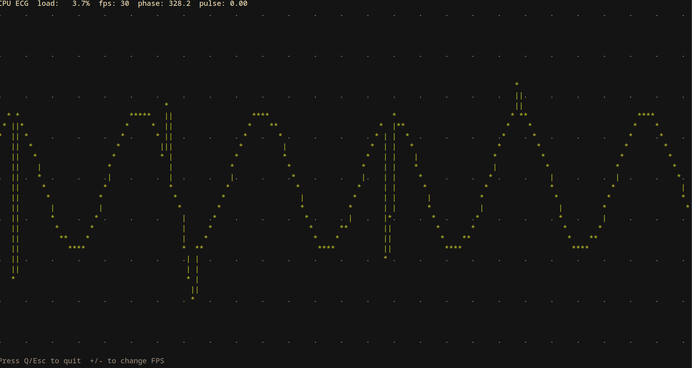

# Electrocardiogram, for your CPU, written in Rust

A terminal ECG-style monitor that renders CPU load as a scrolling waveform. Colors shift from green to yellow to red as the load climbs.


## Features
- Cross-platform CPU load via `sysinfo`
- ECG-style trace with dynamic pulses
- Color-coded load (green/yellow/red)
- Runtime FPS control
## Requirements
- Linux or Windows
- Rust (stable)
## Run
```bash
cargo run
```

## Releases
- GitHub Actions builds release binaries for Linux (x86_64-unknown-linux-gnu) and Windows (x86_64-pc-windows-msvc) on version tags.
## Controls
- `q` or `Esc`: quit
- `+` / `-`: increase or decrease FPS

## Notes
- Default FPS is 30
- FPS is clamped between 10 and 60
- This project is entirely vibe-coded; the original idea came from me.
